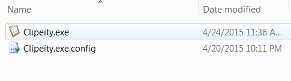
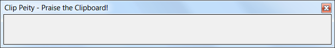
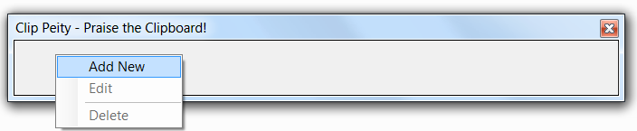
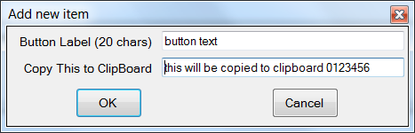
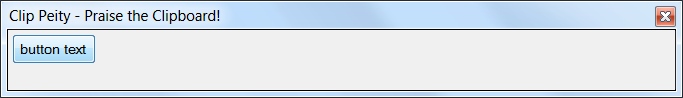
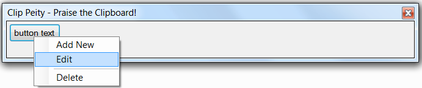
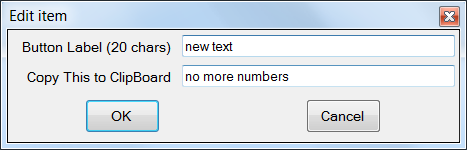
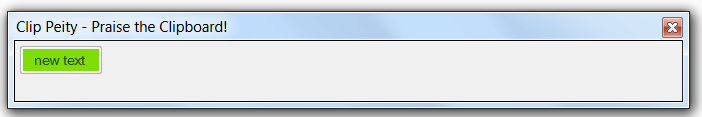
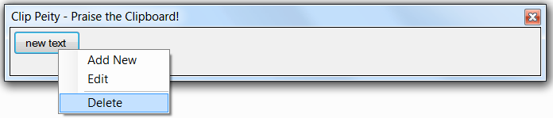

# ClipPeity
ClipPeity is all about praising the twin Gods - Copy, Paste!!

It is a small utility written to store frequently copied text entries in one place with corresponding UI button.

## What can you do with it?
1. It can ease the pain of copying text.
     * It is not uncommon for users to copy-paste certain text multiple times in a day.
2. Assign a button to a text that need to be copied.
3. Edit existing entry.
4. Delete entry.

## Some Screenshots

1. Start ClipPeity by clicking ClipPeity.exe from explorer.
   

2. Once loading, you can start adding items to it. It should look something like below. Right click and a pop-up menu will open.

  
  
  
  
3. Click on "Add New" and enter relevant info into new dialog box. e.g.
  

4. Click OK and the main app will have a new button with previously entered button label.
  

5. For editing an existing button, right click it and click on Edit, enter new values and click "OK" button

  
  
  

6. Now what to do with these button? Click on them!! and whatever was provided in "Copy This to Clipboard" will be copied to Clipboard. In this case "no more numbers". The button will change green and will revert to normal in under 5 seconds.

  
  
7. If a button has lived its life, it can be deleted too. Similar steps as for addition or edit.

  
  
  
